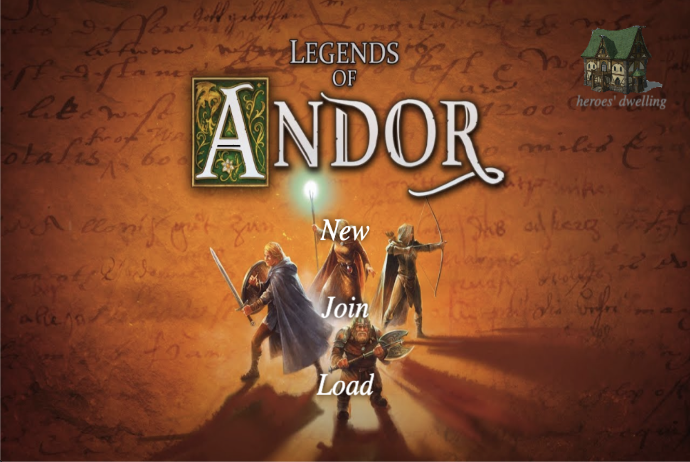

# Legends of Andor
Board game implementation as a web game using Phaser and Socket.io. 



## Game Instructions

In order to play the game you need a minimum of 2 players on the same network. 
Please check <a href="legendsofandor.com"/>the official game website</a> for game rules and instructions.

## Installation
In order to run this game locally, you need to host the server on your own network.
Follow the server instructions on only one device and the client instructions on all the devices.

### Server
```
cd server
npm install
npm run dev
```
Check the terminal for a console log similar to this: <br />
<i> addr: xxx.xxx.xxx </i><br />
You will use this IP address in all the clients in order for them to access the correct server on the network.

### Client
Go to client/src/config/env.js<br />
Replace <i>localhost</i> with the ip you found logged on the server. <br />
Do this for every client device. <br />
Then, in the terminal follow the instructions below.
```
cd client
yarn install
yarn dev
```
Go to **https://localhost:8080/** <br />
Click advance. <br />
You also have to allow insecure content in the site settings. 


### Contributors
 * *Omar Ibrahim*
 * *Philip Cheng*
 * *William Chien*
 * *Anthony Cui*
 * *Jacek Dziewonski*
 * *Cayce McClenen*
 * *Justin Sun*
